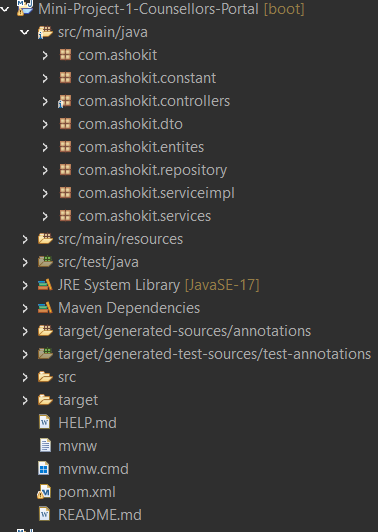
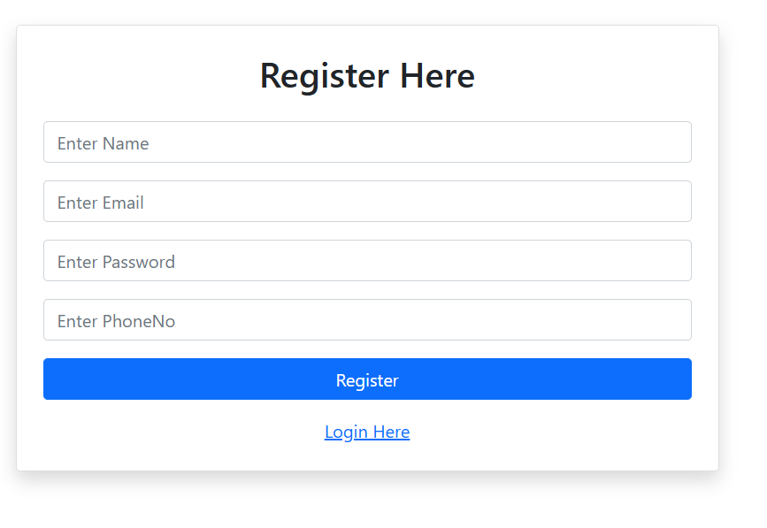
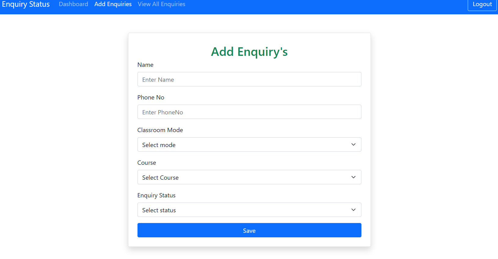
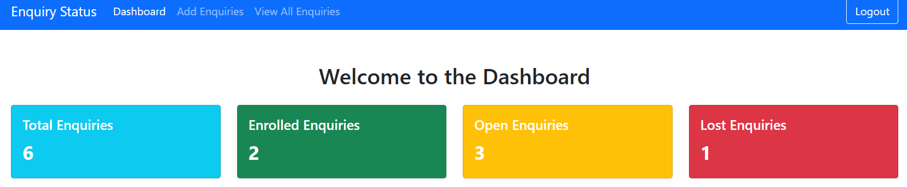
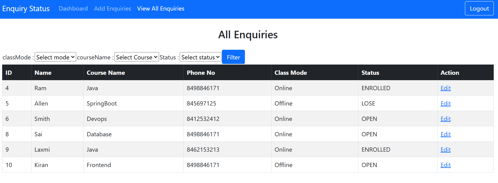

# 🧑‍🏫 Counsellors Portal:

This is a web-based project developed, counsellors manage student enquiries effectively through a personalized dashboard.

## 🚀 Features

- 🔐 **Login Screen** – Secure login functionality for counsellors.
- 📝 **Registration Screen** – Allows new counsellors to register.
- 📊 **Dashboard** – Displays logged-in counsellor's performance and enquiry summary.
- ➕ **Add Enquiry** – Counsellors can add new student enquiries.
- 📋 **View Enquiries** – Logged-in counsellors can see only their own enquiries.

## 🛠️ Technologies Used

- Java / Spring Boot
- Spring MVC
- Thymeleaf (for front-end templates)
- Spring Data JPA
- MySQL Database
- HTML, CSS, Bootstrap (for UI)

## 📦 How to Run

1. Clone the repository:
   ```bash
   git clone https://github.com/Ram-yadav0509/Counselor_Portal/tree/main/src/main/java/com/ashokit


## Project Directory Structure


### Registration Page Snapshot


### Login Page Snapshot 


### Add Enquiry Page Snapshot 


### Dashborad Page Snapshot 


### View All Enquires Page Snapshot 



